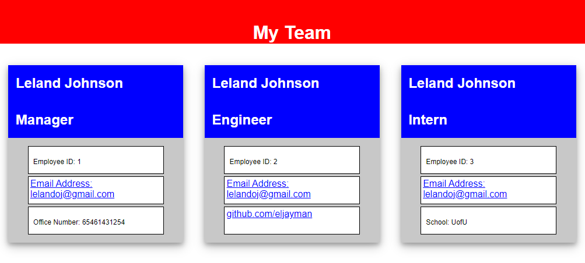

# HTML generator

## Description

This application takes the name, email, ID number, office number, github user, and school of a team and generates an HTML document with cards for the manager and other employees.

## Table of Contents

- [Installation](#installation)
- [Usage](#usage)
- [Credits](#credits)
- [MIT license License](#license)

  

## Video of Usage

[Link](https://watch.screencastify.com/v/J5eywZGNN1ceEBCRQUB3)

## Screenshot of HTML

## Installation

Go to http://github.com/eljayman/08-html-generator and download the files. Once downloaded you will need to initialize the directory with "npm init", then npm "i" for dependencies. You can run the application with "node index.js from the root directory."

## Usage

Once the application is installed and initialized you can run it from the root directory with "node index.js". The HTML will be generated in the /dist folder as index.html.

## Questions

If you have any questions about this application send me an email or message on github.

My email address is: [lelandoj@gmail.com](mailto:lelandoj@gmail.com)

My repo URL is: [eljayman](http://github.com/eljayman)

## How to Contribute

If you would like to contribute to this application, please contact me by sending me a message on github, http://github.com/eljayman.

## Tests

Tests are written for the application. Once installed simply use "npm test" from the command line.

## Credits

This application was made to run in [node.js](https://nodejs.org/) and used [inquirer 8.2.4](https://github.com/SBoudrias/Inquirer.js#readme) as a dependency to create the prompts

## License

    Copyright 2022 eljayman

Permission is hereby granted, free of charge, to any person obtaining a copy of this software and associated documentation files (the "Software"), to deal in the Software without restriction, including without limitation the rights to use, copy, modify, merge, publish, distribute, sublicense, and/or sell copies of the Software, and to permit persons to whom the Software is furnished to do so, subject to the following conditions:

The above copyright notice and this permission notice shall be included in all copies or substantial portions of the Software.

THE SOFTWARE IS PROVIDED "AS IS", WITHOUT WARRANTY OF ANY KIND, EXPRESS OR IMPLIED, INCLUDING BUT NOT LIMITED TO THE WARRANTIES OF MERCHANTABILITY, FITNESS FOR A PARTICULAR PURPOSE AND NONINFRINGEMENT. IN NO EVENT SHALL THE AUTHORS OR COPYRIGHT HOLDERS BE LIABLE FOR ANY CLAIM, DAMAGES OR OTHER LIABILITY, WHETHER IN AN ACTION OF CONTRACT, TORT OR OTHERWISE, ARISING FROM, OUT OF OR IN CONNECTION WITH THE SOFTWARE OR THE USE OR OTHER DEALINGS IN THE SOFTWARE.
